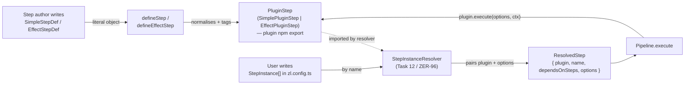

# Step lifecycle

A "step" is zero-line's unit of work inside a workflow. It passes through three
distinct shapes between the step author and the Pipeline.



## The three shapes

| Stage     | Type                                        | Produced by                     | Consumed by                                               |
| --------- | ------------------------------------------- | ------------------------------- | --------------------------------------------------------- |
| Authored  | `SimpleStepDef<T>` / `EffectStepDef<T>`     | Step author (hand-written)      | `defineStep` / `defineEffectStep`                         |
| Compiled  | `SimplePluginStep` / `EffectPluginStep` (`PluginStep` union) | `defineStep` / `defineEffectStep` | plugin package default export; `validateStep`, `loadSteps` |
| Resolved  | `ResolvedStep`                              | step-instance resolver          | Pipeline, preflight, requirements, subcommands            |

### 1. Authored — what the step author writes

Step authors hand-write a `SimpleStepDef` (or `EffectStepDef`) literal and
pass it to `defineStep`. This is the ergonomic, typed-options, `run(opts, ctx)`
surface they care about.

```ts
export default defineStep({
  name: "hello",
  optionsSchema: { decode: (raw) => raw as { greeting?: string } },
  run: async (opts, ctx) => {
    ctx.logger.info(opts.greeting ?? "hello")
    return { done: true }
  },
})
```

The `optionsSchema` is schema-agnostic — any object with a `decode(raw) => T`
method works (`effect/Schema`, `zod`, or a plain function).

### 2. Compiled — what a plugin npm package exports

`defineStep` normalises the authored shape into a `SimplePluginStep`. Two
changes matter:

- `_tag: "simple"` / `_tag: "effect"` — discriminator for the `PluginStep` union
- `dependsOnSteps` guaranteed present (defaulted to `[]`)
- `execute(opts, ctx)` / `run(opts)` — the engine-facing surface (takes opaque
  `Record<string, unknown>`; the author's typed `run` is wrapped inside)

The compiled `PluginStep` is immutable, workflow-agnostic, and shared across
every workflow entry that references the plugin by name.

### 3. Resolved — the runtime unit

The Pipeline doesn't execute `PluginStep`s directly. A workflow in `zl.config.ts`
is a list of `StepInstance`s:

```ts
workflows: {
  greetings: [
    { name: "hello", options: { greeting: "hi" } },
    { name: "hello", alias: "hello-again",
      options: { greeting: "hola" }, dependsOnSteps: ["hello"] },
  ],
}
```

The step-instance resolver (Task 12 / ZER-96) pairs each `StepInstance` with the
matching `PluginStep` from the plugin catalog and emits a `ResolvedStep`:

```ts
{
  plugin: helloPluginStep,
  name: "hello-again",              // workflow-bound; may be an alias
  dependsOnSteps: ["hello"],        // workflow-bound
  options: { greeting: "hola" },    // raw, to be decoded at execution time
}
```

The Pipeline iterates `ResolvedStep[]` in dependency order and dispatches on
`plugin._tag`:

```ts
if (step.plugin._tag === "simple") {
  await step.plugin.execute(step.options, ctx)
} else {
  await runtime.runPromise(step.plugin.run(step.options))
}
```

## Why three shapes?

- **Authored** is ergonomic: typed options, familiar `async run`, no noise.
- **Compiled** is the stable engine-facing contract — one normal form makes
  validation, loading, and dispatch straightforward.
- **Resolved** is what the Pipeline actually needs: a plugin *plus* the specific
  options / alias / dep list for this particular workflow slot. One `PluginStep`
  fans out to many `ResolvedStep`s when a workflow uses the same plugin more
  than once.

Mixing "authored" and "compiled" into a single shape would force the engine to
re-check defaults and the author to carry framework internals; mixing "compiled"
and "resolved" would stop the same plugin from appearing twice in a workflow
with different options.

## Related types

- `StepInstance` (in `config/ConfigTypes.ts`) — the config-level reference:
  `{ name, options?, alias?, dependsOnSteps? }`. Consumed by the resolver.
- `OptionsSchema<T>` — schema-agnostic decoder carried on both author and
  compiled shapes.
- `StepContext` — runtime services (`logger`, `config`, `platform`, `artifacts`)
  passed to `execute` / available inside Effect steps.
